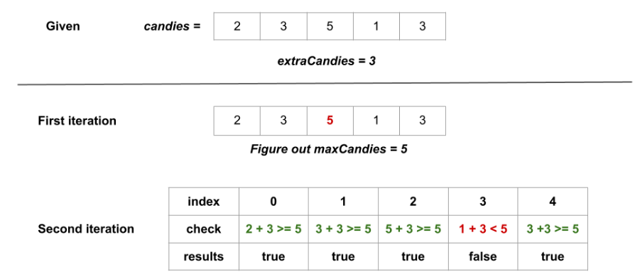

# Approach: Simple Logic

## Intuition

First, we find out the largest number of candies that any kid currently has.  
Let’s call this number `maxCandies`.

Next, for each kid, we check:  
If we give them all the extra candies, will they have as many or more candies
than the kid who has the most right now?  
If yes, we write down `true` for that kid. If not, we write down `false`.

At the end, we return a list of `true` and `false` values for each kid.

Here’s a picture showing how this works for the first example in the problem:  


## Steps

1. Set `maxCandies` to 0.
2. Go through the list of candies and update `maxCandies` to be the biggest
   number you see.
3. Make an empty list called `answer`.
4. For each kid, check if their candies plus the extra candies is at least
   `maxCandies`.  
   If yes, add `true` to `answer`. If not, add `false`.
5. Return `answer`.

## Implementation

```cpp
class Solution {
public:
    vector<bool> kidsWithCandies(vector<int>& candies, int extraCandies) {
        int maxCandies = 0;
        // Step 1: Find the largest number of candies any kid has
        for (int candy : candies) {
            if (candy > maxCandies) {
                maxCandies = candy;
            }
        }

        vector<bool> result;
        // Step 2: For each kid, check if they can have the most candies
        for (int candy : candies) {
            if (candy + extraCandies >= maxCandies) {
                result.push_back(true);
            } else {
                result.push_back(false);
            }
        }

        // Step 3: Return the result
        return result;
    }
};
```

## Complexity

Let `n` be the number of kids.

- **Time:** We look at each kid twice, so the time is O(n).
- **Space:** We only use a few extra variables, so the space is O(1) (not
  counting the answer list).
